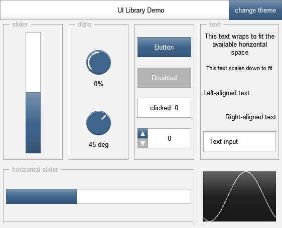

# `ui-lib.jsfx-inc`: UIs for REAPER's JS effects

This is a library/framework for creating UIs in REAPER's JSFX language.

Download the latest version from [GitHub](https://raw.githubusercontent.com/geraintluff/jsfx-ui-lib/master/ui-lib.jsfx-inc), or the [Stash ZIP](https://stash.reaper.fm/v/32955/ui-lib.zip) which also includes API docs.

It requires REAPER v4.60 or above.  See the [Cockos forum topic](https://forums.cockos.com/showthread.php?t=181055) for any questions/bugs/requests.

## Features

*	Flexible layouts (adapts to available space)
*	Rich built-in controls
	*	buttons
	*	sliders
	*	dials
	*	selectors
	*	text-input boxes
*	Multiple screens (including argument-passing)
*	Themes ([default](demo/theme-default.png), [black](demo/theme-black.png), [tron](demo/theme-tron.png))



# API

The best way to get started is the [**quick-start tour**](tour/), which explains some principles of how the library works.  After that, hopefully the API docs will make sense.

The full API is available as [HTML](https://geraintluff.github.io/jsfx-ui-lib/doc/html/) or as an [interactive JSFX plugin](https://stash.reaper.fm/v/32955/ui-lib.zip).

## Compatibilty

The file `ui-lib-compat.jsfx-inc` bridges the gap between the current API and previous versions.

If you update your version of the UI library and it complains about missing functions, include this file as well.

# Development

Development happens in "ui-lib.txt", and the actual library is generated using a [JSFX preprocessor](https://www.npmjs.com/package/jsfx-preprocessor).

This means that to assemble the final code, you'll need Node.js installed.

```
node build.js
# or
npm run build
```

To monitor with `nodemon`, use `npm run nodemon` - you can also specify any additional locations to write the result to (e.g. the [JSFX collection](https://github.com/geraintluff/jsfx)):

```
npm run nodemon -- ../my-jsfx-set/ui-lib.jsfx-inc
```

# Tips and tricks

## Automation, saving state, and "hidden sliders"

You can hide REAPER's default slider by preceding the name with "-":

```
slider1:0<0,1,0>-Slider Name
```

Hidden sliders are still automatable and their state is saved automatically.

Remember to save the state for

```eel2
@gfx

[...]
	my_control_value = control_dial(my_control_value, 0, 1, 0);
[...]

@serialize
file_var(0, my_control_value); // Works for both read/write
```

## Versioning and complex effects

This is not specific to this UI library, but it's a useful trick when developing complex effects.

In `@serialize`, the very first thing you should do is read/write a version indicator.

```eel2
@serialize

preset_version = 1.01;
file_var(0, preset_version);
```

If you make significant changes, bump up this version.  What this means is that you can detect when you're loading a preset from an earlier version of your effect, and can perform some appropriate action.

```eel2
@serialize

preset_version = 1.01;
file_var(0, preset_version);

preset_version < 1.0 ? (
	// Didn't exist in older versions, use default
	saved_value = 5;
) : (
	file_var(0, saved_value);
);
```

If you do this right at the start of developing your effect, you can keep your effect backwards-compatible.
