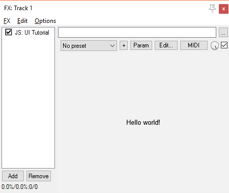

# JSFX-UI tutorial - Hello World

The UI library has a lot of features and can be quite intimidating, but I promise it's not too bad really. :)  Let's start with a very simple example.

Here is the code:

```eel2
desc:JSFX UI: Hello World
import ui-lib.jsfx-inc

@init
freemem = ui_setup(0);

@gfx
ui_start();
ui_text("Hello, world!");
```

Let's go through this code step-by-step:

## The set-up

### Importing the library

First, you need to download `ui-lib.jsfx-inc`, and place it in the same directory as your effect.

Next, in the header of your code (up with `desc:`) import the library:

```eel2
desc:JSFX UI: Hello World

import ui-lib.jsfx-inc
```

### Give it a buffer to use

Next, the UI library needs some working space to store a bit of state.  This should be done in `@init`:

```eel2
@init
freemem = ui_setup(0);
```

The value that you pass in to `ui_setup()` is the beginning of the memory that it's allowed to use.  The return value (stored here as `freemem`) is the next free value that the UI library is not using.

If you have your own audio buffers which are using this memory, then you can either start your buffers after `freemem`:

```eel2
@init
freemem = ui_setup(0);
// Allocate two buffers of length 1024
buffer0 = freemem;
buffer1 = freemem + 1024;
freemem += 2048;
```

Alternatively, you can pass in a different value to `ui_setup()`:

```eel2
@init
// Two buffers of length 1024
buffer0 = 0;
buffer1 = 1024;
// Next free memory slot is 2048
ui_setup(2048);
```

### Reset the UI state for each frame

The UI library has some set-up to do at the beginning of each frame.  This should be the first thing you do in `@gfx`:

```eel2
@gfx
ui_start();
```

If you run your effect at this point, you should see a blank grey screen.

## Draw some text

Now, let's draw some text to the screen, using `ui_text()`:

```eel2
@gfx
ui_start();
ui_text("Hello, world!");
```

## And we're done!

Here's what that should look like in total:

```eel2
desc:JSFX UI: Hello World
import ui-lib.jsfx-inc

@init
freemem = ui_setup(0);

@gfx
ui_start();
ui_text("Hello, world!");
```

