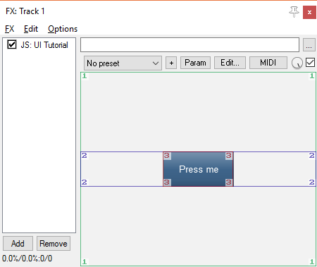
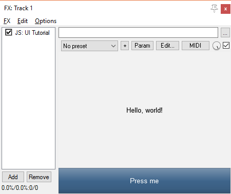
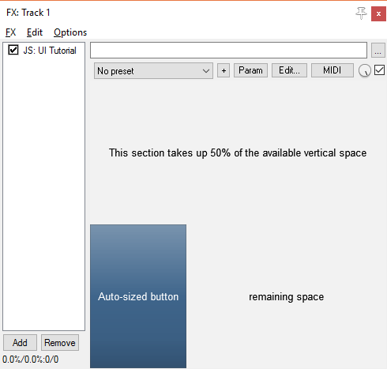
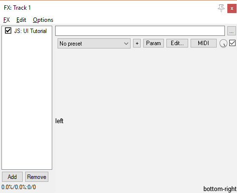
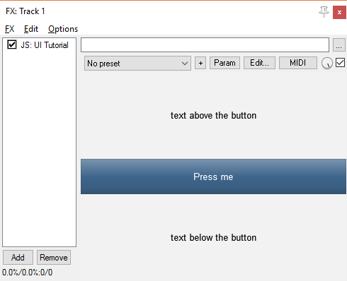

# JSFX-UI tutorial - The Stack

The library always has a "drawing state".  This holds various drawing parameters such as current viewport, colour, font, and so on.

The library actually keeps a stack of these drawing states.  Let's look at a simple example, where we modify the viewport.

## Altering the viewport

The initial viewport is the whole available screen.

### Drawing a button

To draw a button, we call `control_button()` with the text to include as the button text:

```eel2
@gfx
ui_start();

control_button("Press me");
```

Since the viewport starts as the whole screen, this button will fill the whole screen:


### Changing the viewport

Let's change the size of the button.  To do this, we change the viewport.

You don't generally change the viewport of the *current* drawing state.  Instead, you push a new drawing state onto the stack which has the modifications you need.  When you are done, you pop that drawing state off the stack, and the viewport (and other parameters) return to their previous state.

Here, we use `ui_push_height()` to push a new drawing state to the stack, where the height of the new viewport is set to be 50 pixels:

```eel2
ui_push_height(50);
	control_button("Press me");
ui_pop();
```


(Indenting the code like this is useful to keep track of how deep the drawing-state stack currently is.)

To set the width as well, we use `ui_push_width()`.  We're also going to use `ui_debug()`, which illustrates the drawing stack by outlining and numbering the viewport at each level in the stack:

```eel2
ui_push_height(50);
	ui_push_width(100);
		control_button("Press me");
		ui_debug();
	ui_pop();
ui_pop();
```



Here, you can see the stack of drawing states at the time that `ui_debug()` is called.  The top level (1) has a viewport that covers the entire available area.  The second level (2) in the stack has the correct height, and the third (3) has the correct width and height.

Now, what happens if we move `ui_debug()` one line down, so it's below `ui_pop()`?

```eel2
ui_push_height(50);
	ui_push_width(100);
		control_button("Press me");
	ui_pop();
	ui_debug();
ui_pop();
```


As you can see, there are only two layers in the drawing-state stack at the point.  The drawing-state which was previously labelled "3" has been forgotten by the time `ui_debug()` is called.

## Splitting the viewport

Often, once you've drawn the UI in an area of the screen, you want to avoid using that area of the screen for anything else.  However, with the previous code, when we called `ui_pop()` the viewport returned to its previous state, which is inconvenient.

So, we have a family of functions: `ui_split_top()`, `ui_split_bottom()`, `ui_split_left()` and `ui_split_right()`.  These functions push a new viewport to the stack, but they also *modify* the old viewport to avoid this area.  Let's look at an example:

```eel2
ui_split_bottom(50);
	ui_debug();
ui_pop();
```


Here, when we call `ui_debug()` the stack is two levels deep.  However, while the first level (1) was originally filling the whole screen, it is now smaller, so that it no longer overlaps the second level (2).

Let's see how this looks using a button and some text:

```eel2
ui_split_bottom(50);
	control_button("Press me");
ui_pop();
ui_text("Hello, world!");
```



As you can see, the "Hello, world!" text is now vertically centred in the remaining space above the button.

### `ui_split_next()`

Now, let's introduce another very useful function: `ui_split_next()`.

This function pops the current viewport off from the stack, and then *re-*splits using the same height/width.  This is very useful for creating stacks of elements:

```eel2
ui_split_bottom(50);
	control_button("Press me");
ui_split_next();
	control_button("Then press me");
ui_pop();
ui_text("Hello, world!");
```


So, the second button is exactly the same height.  If you're not sure what the viewport stack looks like at any point during this, then add `ui_debug()` to see what it's doing.

### Splitting with ratios or text height

Often instead of splitting with an exact height/width, you might want to split either as a proportion (e.g. 50% of the height), or to fit a certain piece of text (e.g. just enough width to fit some text in your button).

For these, you can use the variants: `ui_split_leftratio()` or `ui_split_lefttext()` (and similar for right/top/bottom).  Let's take a look at this code which uses both techniques:

```eel2
ui_split_topratio(0.5);
	ui_text("This section takes up 50% of the available vertical space");
ui_pop();

ui_split_lefttext("Auto-sized button");
	control_button("Auto-sized button");
ui_pop();

ui_text("remaining space");
```



The `ui_push_height()` and `ui_push_width()` functions also have these variants (`ui_push_heightratio()` and so on).

## Alignment

In all the above examples, text is always displayed centred in the available space.  Similarly, in earlier examples when we used `ui_push_height()`, the new viewport was centred within the previous one.

This is because the horizontal/vertical alignment is central by default.  You can change the alignment using `ui_align(horizontal, vertical)`.  Both arguments are values between 0 and 1, where 0 is top/left, and 1 is bottom/right.  If you specify `-1` for either of these, it preserves the current value.

```eel2
ui_align(0, -1);
ui_text("left");
ui_align(1, 1);
ui_text("bottom-right");
```



### `ui_push_above()` and others

If you have drawn part of your UI using a specific height/width and alignment, you might want to then fit something else into the space around it.

For this, you can use the functions `ui_push_above()`, `ui_push_below()`, `ui_push_leftof()` and `ui_push_rightof()`.  They take the same arguments as `ui_push_height()`, and have the same ratio/text variants (e.g. `ui_push_aboveratio()` and `ui_push_abovetext()`).

For example, here we draw a button right in the middle of the screen.  We then fit some text above and below this button:

```eel2
ui_push_height(50);
	control_button("Press me");
ui_pop();
ui_push_above(50);
	ui_text("text above the button");
ui_pop();
ui_push_below(50);
	ui_text("text below the button");
ui_pop();
```



### Custom graphics

At some point you might want to draw your own display (or even create custom components by defining a function) while fitting in with the layout logic provided by the UI library.  This is what you'll need:

#### Geometry

You can get the current viewport size/shape using `ui_left()`, `ui_right()`, `ui_top()`, `ui_bottom()`, `ui_height()` and `ui_width()`.

It might be worth noting that (similarly to `gfx_w` and `gfx_h`) the right/bottom sides of the viewport (`ui_right()` and `ui_bottom()`) are slightly over the edge.  If you are drawing a line down the side, you might want to use `ui_right() - 1` or similar.

#### Colours

If you are changing the colour (`gfx_a`/`gfx_r`/`gfx_g`/`gfx_b`), then you should be aware that this colours may be reset if you use UI library code (e.g. `ui_text()`).

As such, you might want to use `ui_color(r, g, b)` or, `ui_colora(r, g, b, a)` instead.  As well as modifying the appropriate `gfx_` variables, this changes the colour in the current drawing state (as used by `ui_text()` or others).  The RGB values are in the range (0-255), but alpha is still (0-1).
