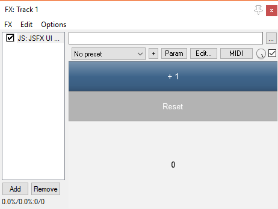

# JSFX-UI tutorial - Controls

Now we understand how to do layout using the UI library, let's look at some useful things we might want to draw!

The fundamental UI functions are all prefixed with `ui_`, and have very predictable behaviour.  They are used for layout, and specific styling (e.g. fonts, colours).

There are some built-in elements (such as buttons, sliders, dials and readouts), referred to as "controls".  These elements have a specific style/theme and interactions.  They are all prefixed with `control_` - this is to deliberately separate them from the fundamental UI functions, because the appearance and interactions of these controls can change (e.g. due to visual theme changes, new features in future versions, etc.).

## Buttons

To draw a button, use `control_button()`.

This function will return `1` when the user clicks the button.  You can therefore use this in a conditional statement to run code:

```eel2
ui_split_top(50);
	control_button("+ 1") ? (
		press_counter += 1;
	);
ui_split_next();
	control_button("+ 100") ? (
		press_counter += 100;
	);
ui_pop();

ui_textnumber(press_counter, "%i");
```



## Sliders and dials

To draw a slider, use `control_hslider()` or `control_vslider()` for horizontal/vertical sliders.  To draw a dial, use `control_dial()`.  These controls respond to clicking, dragging, and the scroll wheel.

Because the JSFX language doesn't have variable references, these functions can't change the values in-place.  Instead, you always pass in the current value, and the function returns the *new* value, like so:

```eel2
value = control_dial(value, low, high, curve);
```

All three functions take the same four arguments: `value`, `low`, `high` and `curve`, and they return the new value.  The `curve` argument determines how the visual ratio of the slider maps to the numerical range of `value`.  For a linear, use `0`.  For a logarithmic curve, use `log(high/low)`.

Let's look at an example with three different types of sliders:

```eel2
ui_pad();
ui_split_bottom(30);
	slider1 = control_hslider(slider1, 0, 100, 0);
ui_pop();

ui_padbottom();
ui_split_left(30);
	slider1 = control_vslider(slider1, 0, 100, 0);
ui_pop();

ui_push_height(50);
	slider1 = control_dial(slider1, 0, 100, 0);
ui_pop();
```

;

Since the controls draw themselves covering the whole viewport, you might want to use `ui_push_height()` or `ui_push_width()` to get them to be a sane size.

(We have cheekily used the `ui_pad()` and `ui_padbottom()` functions in order to get some nice spacing in there.)

## Groups

To group UI elements together, you can use `control_group(name)`.  This draws a border and a label, and pads the current viewport, so that the contents of the group are placed in from the border.

```eel2
ui_split_leftratio(0.5);
	control_group("Group with a dial in it");
	ui_push_width(50);
		slider1 = control_dial(slider1, 0, 100, 0);
	ui_pop();
ui_split_next();
	control_group("Group with one giant button");
	control_button("Press me");
ui_pop();
```