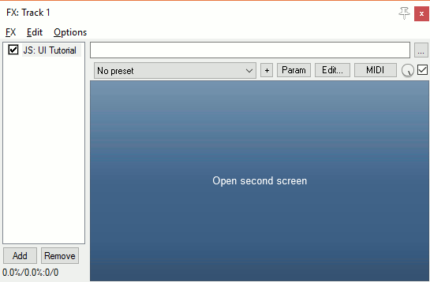

# JSFX-UI tutorial - Screens

For all previous examples, the effect has had only one possible interface.  However, we sometimes want effects that have multiple screens.  The UI library has built-in support for a stack of different screens, including arguments.

If your UI only has one screen, you can omit this entirely.

## Default screen

First, we specify a default screen.  This is an argument we pass into `ui_start()`, like so:

```eel2
@gfx
ui_start("main"); // Our default screen is called "main"
```

Note: the actual identifier is a number.  However, strings are represented by numbers, and the same string *constant* is represented by the same number anywhere in the code (`"my string" == "my string"`), so they make for convenient and readable identifiers for screens
```

## Checking the current screen

We can choose which screen to draw by checking `ui_screen()`, which gives us the identifier for that screen.  To have multiple screens, we test this value and react appropriately.

For example, here is a UI with two screens on it

```eel2
@gfx
ui_start("main");

ui_screen() == "main" ? (
	ui_text("Main screen");
) : ui_screen() == "second" ? (
	ui_text("Second screen");
);
```

Since we have no way to switch between screens, it will only ever draw the default screen (`"main"`).

### Built-in screens

If we don't recognise the screen identifier, we should let the UI library handle the screen.  At the very least, this will display a message saying the screen identifier was not recognised, but there are also some built-in screens (such as `"error"`) which are useful.

The main built-in screens are drawn using `ui_system()`.  However, there is also a `control_system()` which handles some more built-in screens, such as a text-prompt dialog.

```eel2
@gfx
ui_start("main");

ui_screen() == "main" ? (
	ui_text("Main screen");
) : ui_screen() == "second" ? (
	ui_text("Second screen");
) : control_system();
```

## Opening and closing screens

To push a new screen onto the stack, use `ui_screen_open(id)`.  To pop a screen from the stack, use `ui_screen_close()`.

There are also two variants: `ui_screen_close_id(id)` (which only closes if the current screen ID matches), and `ui_screen_close_to(id)` (which closes screens until a screen of the specified ID is reached);

```eel2
@gfx
ui_start("main");

ui_screen() == "main" ? (
	control_button("Open second screen") ? (
		ui_screen_open("second");
	);
) : ui_screen() == "second" ? (
	control_button("Close screen") ? (
		ui_screen_close();
	);
) : control_system();
```



## Opening screens with arguments

As well as opening screens, you can provide arguments to be used by that screen.  To set an argument for the current screen, use `ui_screen_set(index, value)`, and to read an argument, use `ui_screen_get(index)`.

For example, here are two screens, where the second screen displays which button was used to open it:

```eel2
@gfx
ui_start("main");

ui_screen() == "main" ? (
	ui_split_leftratio(0.5);
		control_button("Open (left)") ? (
			ui_screen_open("second");
			ui_screen_set(0, 0);
		);
	ui_split_next();
		control_button("Open (right)") ? (
			ui_screen_open("second");
			ui_screen_set(0, 1);
		);
	ui_pop();
) : ui_screen() == "second" ? (
	ui_split_bottom(50);
		control_button("Close screen") ? (
			ui_screen_close();
		);
	ui_pop();
	
	side = ui_screen_get(0);
	ui_text(side ? "right" : "left");
) : control_system();
```

