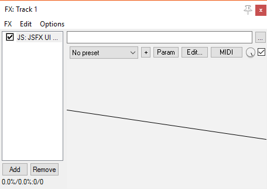
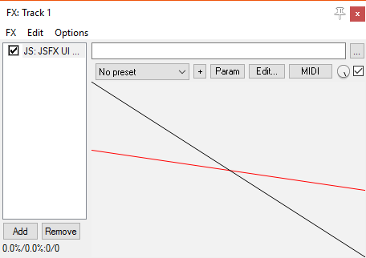
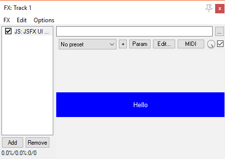
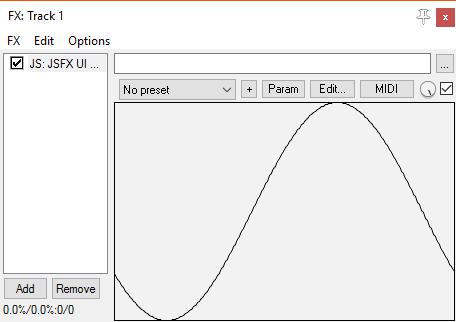

# Custom graphics

At some point you might want to draw your own display (or even create custom components by defining a function) while fitting in with the layout logic provided by the UI library.  These are the functions to help you do that:

## Geometry

You can get the current viewport size/shape using `ui_left()`, `ui_right()`, `ui_top()`, `ui_bottom()`, `ui_height()` and `ui_width()`.

It might be worth noting that (similar to `gfx_w` and `gfx_h`) the right/bottom sides of the viewport (`ui_right()` and `ui_bottom()`) are slightly over the edge.  If you are drawing a line down the side, you might want to use `ui_right() - 1` or similar.

```eel2
// Do some viewport manipulations
ui_push_height(50);
	// Draw a diagonal line across the current viewport
	gfx_line(ui_left(), ui_top(), ui_right(), ui_bottom());
ui_pop();
```



## Colours

To change the current colour, use `ui_color(r, g, b)` or `ui_colora(r, g, b, a)`.  The RGB values are in the range (0-255), but alpha is still (0-1).

This colour is stored in the drawing-state stack, so when you pop a drawing state off from this stack, the colour is reset.

```eel2
ui_push_height(50);
	ui_color(255, 0, 0);
	// This line draws in red
	gfx_line(ui_left(), ui_top(), ui_right(), ui_bottom());
ui_pop();

// This line draws in the default colour
gfx_line(ui_left(), ui_top(), ui_right(), ui_bottom());
```



If you change the colour using `gfx_a`/`gfx_r`/`gfx_g`/`gfx_b`, then this will be reset if you use UI library code (e.g. `ui_text()`).

## Drawing functions

This library is focused assembling UIs, not general-purpose drawing, so it doesn't have lots of graphics functions.  However, there are some things which are common enough that they are included:

### `ui_fill()`

Fills the current viewport with the current colour.

```eel2
ui_push_height(50);
	// Fill the viewport with blue
	ui_color(0, 0, 255);
	ui_fill();
	// Draw some white text
	ui_color(255, 255, 255);
	ui_text("Hello");
ui_pop();
```



### `ui_border()`

Draws a border in the current colour.

## Graphing

Effects often have a display that draws some internal buffer as a graph.  We therefore have two functions, `ui_graph(buffer, length, y_low, y_high)` and `ui_graph_step(buffer, count, step, y_low, y_high)`, which draw the values in the buffer (scaled to the viewport size) using the current colour.

The values of `y_low` and `y_high` specify which values will be at the bottom/top of the viewport.  If both values are the same, then the graph is auto-scaled, keeping this value in the centre.

```eel2
ui_border();
ui_graph(buffer, buffer_length, -1, 1);
```



## Theme functions

To help your UIs look consistent, there are some functions to help your custom controls/displays fit into the rest of the visual theme.  The functions come in pairs: one draws a background, and one draws a gloss/finish.

There are five types of display, for different uses:

*	`enabled` - used by buttons
*	`disabled` - used by disabled buttons
*	`inset` - used for meters/displays
*	`passive` - used by static non-interactive elements (e.g. navbar)
*	`technical` - used for technical displays (e.g. graphs). Usually dark/black, but may be tinted.

For each of these, there is a `control_background_...()` and a `control_finish_...()` function.  The background function draws a background, but also changes the current drawing colour to something suitable (as chosen by the theme).

For example, here is a layout with a bottom-bar containing two buttons and a graph.  The graph is a custom element, drawn using the "technical" helper functions:

```eel2
ui_split_bottom(50);
	// Button on left
	ui_split_left(50);
		control_button("Left");
	ui_pop();
	// Button on right
	ui_split_right(50);
		control_button("Right");
	ui_pop();
	
	// Fill the rest with a graph
	control_background_technical();
	ui_graph(buffer, buffer_length, -1, 1);
	control_finish_technical();
ui_pop();
```


Here is the same layout, rendered with two different themes (note that the colour of the graph changes):


